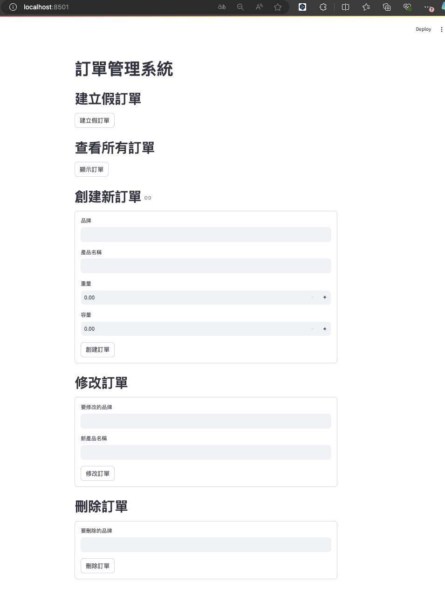
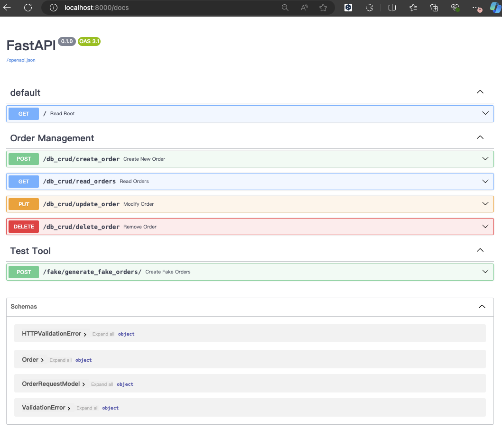
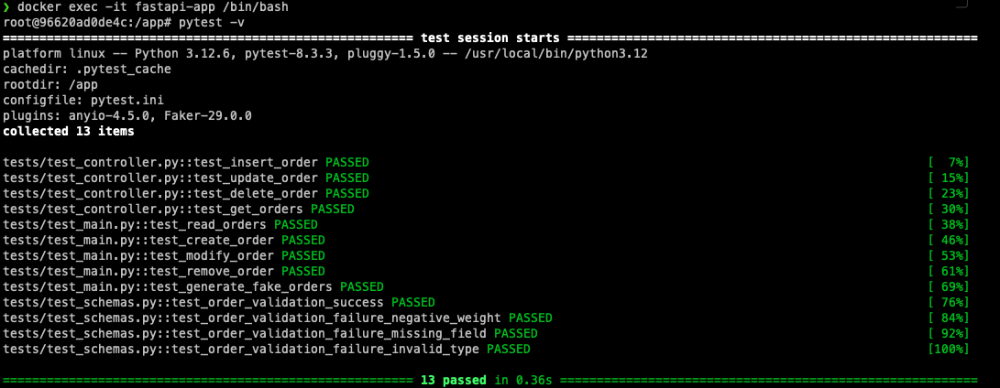

## 專案說明
這個專案是一個基於 FastAPI 框架的後端應用，並通過 Docker 部署。提供一個 RESTful API 服務，主要用於 訂單管理 的相關操作，如創建訂單、讀取訂單、更新訂單、刪除訂單等。專案中的資料庫採用了 MySQL，並通過 SQLAlchemy 進行數據庫操作。

## 開發環境說明
- **畫面**: 使用**streamlit**套件，開發簡易的介面。
- **框架**: 使用 **FastAPI** 開發。
- **單元測試**: 採用 **pytest** 進行測試，確保功能正確性。
- **容器化部署**: 使用 **Docker** 來管理應用環境，確保可移植性和一致性。
    - **Docker 版本**: 26.1.1
    - **Docker Compose 版本**: v2.27.0-desktop.2

## 專案目錄結構

- **app/backend/**:  
  主要包含專案的後端邏輯，包括資料庫模型、API 路由、控制器、資料庫操作等。
  - **`main.py`**:  
  FastAPI 應用的入口點。定義了應用的基本設置，並引入了路由。

  - **`controller/`**:  
    包含業務邏輯和資料庫操作的控制器。在這裡定義了應用如何與資料庫交互，處理訂單相關的增、刪、改、查功能。
  
  - **`database/`**:  
    包含與資料庫連接相關的邏輯。主要通過 SQLAlchemy 來建立與 MySQL 或其他 SQL 資料庫的連接，並實現基本的資料庫操作。

  - **`models/` 和 `schemas/`**:  
    - `schemas/`: 用於定義資料庫模型，確定數據結構如何存儲在資料庫中。  
    - `models/`: 使用 Pydantic 定義數據驗證和轉換模型，確保從 API 接收到的數據格式正確。

  - **`router/`**:  
    包含 API 路由邏輯，定義了每個 API 端點的具體操作（如 `/db_crud/read_orders`、`/db_crud/create_order` 等）。這裡將應用的業務邏輯和數據操作功能與 API 進行對接。

  - **`tests/`**:  
    測試文件夾，包含單元測試和其他測試代碼，使用 `pytest` 來檢驗應用的功能和正確性。

- **frontend/**:  
  主要為 streamlit 相關檔案。


## 運行服務
1. **建立 Docker 映像**：
    ```bash
    docker compose build
    ```

2. **啟動容器**：
    ```bash
    docker compose up -d
    ```

3. **瀏覽 UI(streamlit)**
    ```bash
    http://localhost:8501
    ```
    > **注意**: 請確保 **8501** port 未被其他應用程序佔用，以免影響服務運行。
    - 畫面參考
    

3. **瀏覽 API 文件**：
    ```bash
    http://localhost:8000/docs
    ```
    > **注意**: 請確保 **8000** port 未被其他應用程序佔用，以免影響 API 的正常運行。
    - 畫面參考
    
   
## 功能測試
- test_main.py: API 端點測試：測試路由的正確行為。
- test_controller.py: 模擬資料庫庫操作並測試業務邏輯
- test_schemas.py: 測試數據驗證和結構

### 指令
```bash
docker exec -it fastapi-app /bin/bash
```
進到容器後，執行：
```bash
pytest -v
```
## 測試結果參考

### 說明：
- PASSED: 測試通過。
- XFAIL: 預期失敗的測試案例，如預期失敗，故測試通過。


